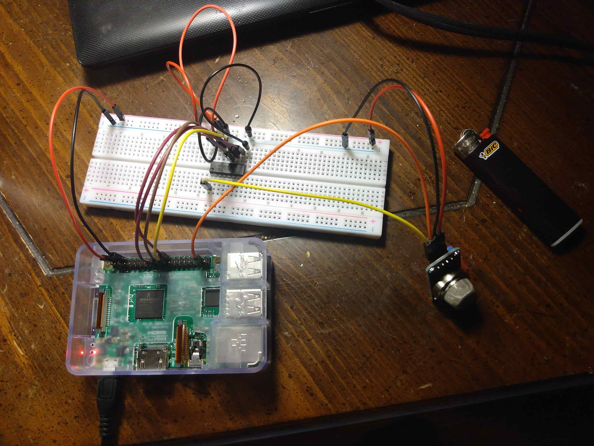
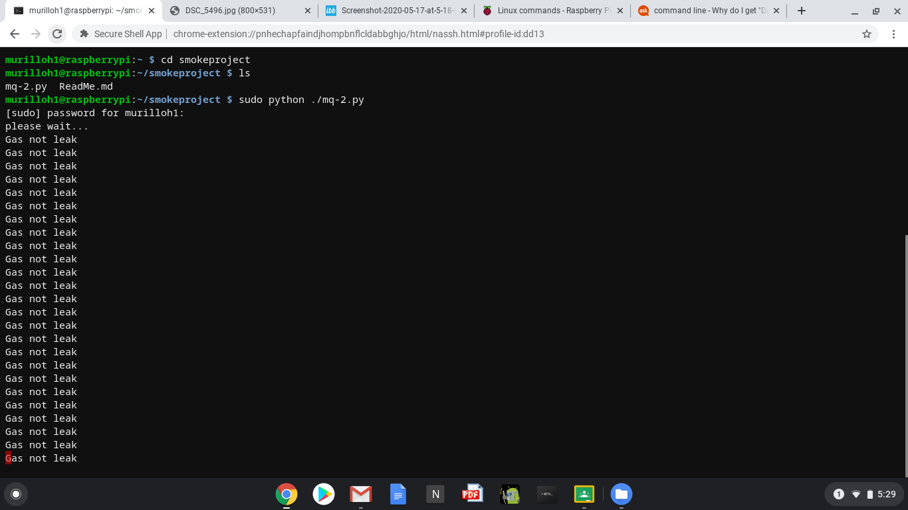
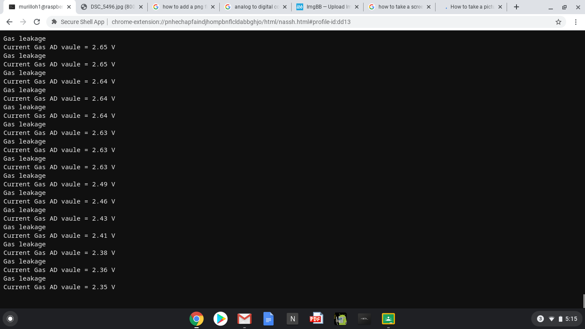

# Final Smoke Detector

The purpose of this project is to design a smoke detector through a raspberry pi board and MQ-2 smoke sensor.It can detect the concentration of the smoke in the environment.The gas-sensing materials the MQ-2 sensor used is SnO2 material,which is lower conductivity in clear air, the conductivity of sensor would go up with the increase of the smoke concentration.The sensor can convert the different conductivity to the correspondent output signal of the smoke concentration.The MQ-2 gas sensor has high sensitivity to liquefied petroleum gas,propane, and hydrogen

# Setting up the Pi:

Materials needed :
1) raspberry pi 3
2) breadboard
3) MQ-2 sensor
4) Analog to digital convertor
5) 4 male to male jumper wires
6) 9 male to female jumper wires
7) 1 female to female jumpe wire 

As only the digital signal can be processed by raspberry pi, we need to add a analog to digital converter (ADC) to process the analog signal from MQ-2 sensor.It can detect the smoke in the air according to the valtage value. MCP3008 as ADC chip is very common and recommended highly.

The MQ-2 sensor can output the analog and digital signal when the work voltage is 2.5V-5V. When the CO gas is detected by sensor, the signal light turns on and the digital signal output the low-level valtage. In additon, there is a adjustable resistor to change the sensor sensitivity.

Schematic Diagram on how to wire the raspberry pi  to the breadboard with all the parts

# Setup the Code and Run it
1) Make a directory for the smoke detector
**mkdir smokedector**
2) Add new file named mq-2.py under the /home/pi file path via nano editor (the name is arbitrary)

**sudo nano mq-2.py**

3) Write the sample code in new file, the code can be obtained by executing shell commands.

**sudo wget --no-check-certificate   http://osoyoo.com/driver/mq-2.py**

4) Execute python program

**sudo python ./mq-2.py**

When the programme start, there is no signal output within 20s.The sensor would preheat 20s firstly,then output after the data remain stable.It is normal for sensor to stay hot slightly.It can produce the smoke using the lighter.When you light the lighter in front of sensor,there is a signal output of “Gas lealage” word and the valtage value, the signal light turns on . If these the phenomenon above doesn’t appear, you could swing clockwise to adjust the resistor until the above phenomenon appear.

**Picture of the the wired breadboard**

**Screenshot of program 1st running**

**Screenshot of program running when lighter used**

